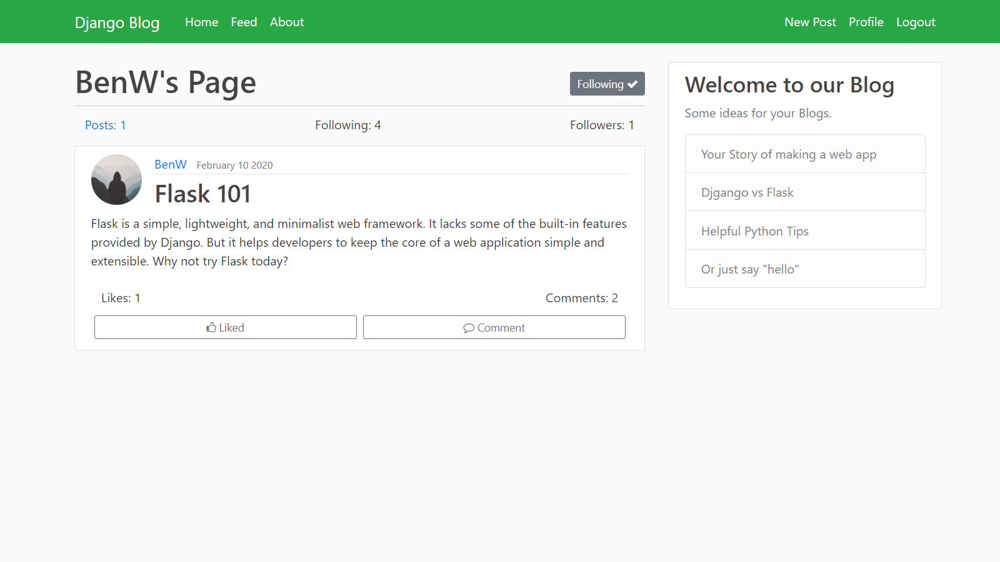

# Django-Blog
I have built an app that allows users to create and post their own blogs to a web page using the Django framework 
for the backend and HTML5/CSS with some bootstrap classes for the frontend. The app has a login and a create an 
account page with authentications checks implemented. Users can post blogs, comment on blogs and follow other users.
Each user has their own profile page and picture, and I have paginated the blogs on the homepage. Furthermore While 
completing this project I learnt a lot about web views, models, templates, databases and urls.

# Screen Shots

